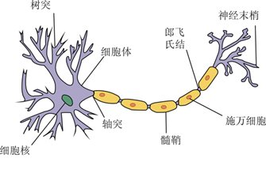
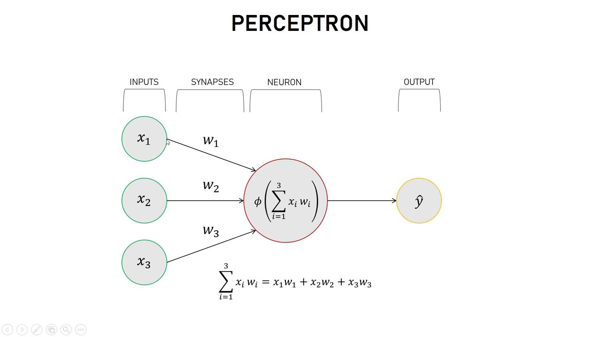
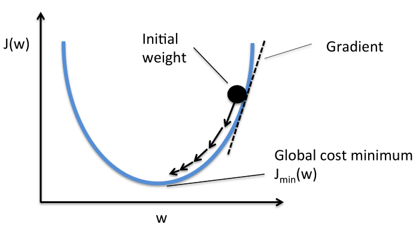

# TensorFlow2.0基础教程

## 一. 深度学习

**深度学习**是机器学习领域中一个新的研究方向，它被引入机器学习使其更接近最初的目标——人工智能。它模仿人脑在处理数据和创建决策模式时的工作方式，利用层次化的人工神经网络从数据中学习模式。



### 1. 感知机



### 2. 深层神经网络


* 输入层
* 隐藏层
* 输出层

以机票价格预测为例：

**输入层**接收输入数据，始发机场、目的地机场、出发日期、航空公司。输入层将输入传递到第一层隐藏层。

**隐藏层**对输入做相关运算。使用神经网络的难点之一就是确定隐藏层的数量以及每层神经元的数量。深度学习中的“**深度**”就是指有很多层隐藏层。

**输出层**输出我们要预测的数据，在本例中就是机票的价格。


那么它是如何计算出机票价格的呢？

神经元之间的每个连接都有一个权重，该权重决定了输入值的重要性，初识权重是随机设置的。除此之外，每个神经元都有激活函数，用于“标准化”神经元的输出。
$$
a^{[1]}=\begin{bmatrix}
a_1^{[1]}\\
a_2^{[1]}\\
a_3^{[1]}\\
a_4^{[1]}\\
\end{bmatrix}
=\sigma(\begin{bmatrix}
w_1^{[1]T}\\
w_2^{[1]T}\\
w_3^{[1]T}\\
w_4^{[1]T}\\
\end{bmatrix}\begin{bmatrix}
x_1^{[1]}\\
x_2^{[1]}\\
x_3^{[1]}\\
\end{bmatrix}+\begin{bmatrix}
b_1^{[1]}\\
b_2^{[1]}\\
b_3^{[1]}\\
b_4^{[1]}\\
\end{bmatrix})=\sigma(W^{[1]T}x+b^{[1]})
$$
**训练/学习**

训练过程需要大量的历史数据（标注数据），将数据通过模型得到的输出与真实的历史数据相比较，定义一个函数来表示模型的输出和真实数据的偏差程度，这个函数就是**代价函数**。

训练的目的就是为了让代价函数最小。

梯度下降通过计算特定权重下代价函数的梯度，在每次数据集迭代后以较小的增量更改权重，使得代价函数朝最小值的方向不断前进。



## 二. TensorFlow基础

### 1. 计算模型

Tensorflow是一个通过计算图的形式来表述计算的系统。其中计算图上的每一个节点都代表一个计算，而节点之间的边描述了计算之间的依赖关系。

Tensor：张量（多维数组）

Flow: "流"，表示张量之间通过计算相互转换的过程

```python
import tensorflow.compat.v1 as tf
tf.disable_v2_behavior() # 禁用2.x特性，使用1.x

a = tf.constant([1.0,2.0],name="a")
b = tf.constant([2.0,3.0],name="b")
c = tf.sqrt(a*b)

writer = tf.summary.FileWriter("./log",tf.get_default_graph()) # 保存训练过程
writer.close()
```

```bash
tensorboard --logdir=path
```

这里就是一个简单的$\sqrt{ab}$计算，圆圈代表的就是节点，就是一个计算，被称为operation，边代表的是依赖关系，因为ab是常量，所以就没有依赖边。

计算图分为两个阶段，在第一个阶段会定义计算图中的所有计算，第二个阶段是执行计算。

Tensorflow通过tf.Graph()函数来定义计算图，每一张图拥有独立的张量和运算。如果不指定图，会使用默认图，通过tf.get_default_graph()函数可以获取当前的默认图。

### 2. 数据模型

**张量**：是对Tensorflow中运算结果的引用，在张量中并没有真正保存数字，它保存的是如何得到这些数字的计算过程。Tensor的内容不可变，只能创建新的Tensor。

```pyt
<tf.Tensor 'Sqrt:0' shape=(2,) dtype=float32>
```

* 名字：张量的唯一标识符，同样也给出了这个张量是如何计算出来的。张量的命名以“node:src_output”的形式给出，node表示对应的计算，src_output表示节点的第几个输出。
* 维度：描述张量的维度信息。例如(2,)代表长度为2的一维数组。
* 类型：张量之间类型匹配才可以进行相应的计算。

张量的使用：一是对中间计算结果的引用，二是用于获得计算结果

tf.placeholder:占位符节点，可以理解为形参，看作是用户的输入，需要在调用session.run时传递。

```python
tf.placeholder(shape=(2,1),dtype=tf.float32,name="input")
```

tf.Variable:变量，需要其他节点传递值或者通过某些方法来初始化

```python
tf.Variable(tf.random_normal((1,2),stddev=1,seed=1),name="d")
```

### 3. 运行模型

Tensorflow通过**会话**(Session)来执行在图中定义好的运算，会话拥有并管理Tensorflow运行时的所有资源。

```python
sess = tf.Session() # 创建一个会话
sess.run(...) # 使用创建好的会话来计算想要得到的结果
sess.close() # 关闭会话
```

```python
with tf.Session() as sess:
    print(sess.run(c))
```

一个完整的样例程序：

```python
import tensorflow.compat.v1 as tf
tf.disable_v2_behavior()
from tensorflow.keras.datasets.mnist import load_data

import numpy as np

INPUT_NODE = 784 # 输入层
OUTPUT_NODE = 10 # 输出层
LAYER1_NODE = 500 # 隐藏层

def get_weight_variable(shape):
    weights = tf.get_variable("weights", shape, initializer = tf.truncated_normal_initializer(stddev=0.1)) # 截断正态分布，2倍标准差以内
    return weights

def inference(input_tensor):
    with tf.variable_scope('layer1'): # layer1/biases:0
        weights = get_weight_variable([INPUT_NODE, LAYER1_NODE])
        biases = tf.get_variable("biases", [LAYER1_NODE], initializer = tf.constant_initializer(0.0))
        layer1 = tf.nn.relu(tf.matmul(input_tensor, weights) + biases)
    
    with tf.variable_scope('layer2'):
        weights = get_weight_variable([LAYER1_NODE, OUTPUT_NODE])
        biases = tf.get_variable("biases", [OUTPUT_NODE], initializer = tf.constant_initializer(0.0))
        layer2 = tf.matmul(layer1, weights) + biases
    
    return layer2

BATCH_SIZE = 100
LEARNING_RATE_BASE = 0.005
LEARNING_RATE_DECAY = 0.99
TRAINING_STEPS = 6000

def train(mnist):
    x = tf.placeholder(tf.float32, [None,INPUT_NODE], name="x-input")
    y_ = tf.placeholder(tf.float32, [None,OUTPUT_NODE], name="y-input")
    
    y = inference(x)
    train_size = mnist[0][0].shape[0]
    mnist_x = np.reshape(mnist[0][0],[-1,784])
    mnist_y = np.eye(10)[mnist[0][1]]
    
    test_feed = {x: np.reshape(mnist[1][0],[-1,784]), y_: np.eye(10)[mnist[1][1]]}
    
    global_step = tf.Variable(0, trainable=False)
    
    cross_entropy = tf.nn.sparse_softmax_cross_entropy_with_logits(logits=y, labels=tf.argmax(y_, 1))
    loss = tf.reduce_mean(cross_entropy)
    learning_rate = tf.train.exponential_decay(LEARNING_RATE_BASE, global_step,train_size / BATCH_SIZE, LEARNING_RATE_DECAY) # decayed_learning_rate = learning_rate * decay_rate ^ (global_step / decay_steps)
    train_step = tf.train.GradientDescentOptimizer(learning_rate).minimize(loss, global_step=global_step)
    
    correct_prediction = tf.equal(tf.argmax(y, 1), tf.argmax(y_, 1))
    accuracy = tf.reduce_mean(tf.cast(correct_prediction, tf.float32))
    
    
    with tf.Session() as sess:
        tf.global_variables_initializer().run()
    
        for i in range(TRAINING_STEPS):
            xs, ys = mnist_x[i*BATCH_SIZE%train_size:(i+1)*BATCH_SIZE%train_size], mnist_y[i*BATCH_SIZE%train_size:(i+1)*BATCH_SIZE%train_size]
            _, loss_value, step = sess.run([train_step, loss, global_step], feed_dict={x: xs, y_: ys})
            
            if i%100 == 0:
                test_acc = sess.run(accuracy, feed_dict=test_feed)
                print("After {} training steps, loss on training batch is {},test accuracy is {}".format(step, loss_value, test_acc))

mnist = load_data("mnist.npz")
train(mnist)

writer = tf.summary.FileWriter("./log",tf.get_default_graph())
writer.close()
```

### 4. Keras

Keras是一个高级神经网络API，可以以Tensorflow、CNTK、Theano作为后端运行。利用此API，可以实现快速的模型设计和拓展。

* 序列式模型（Sequential）

  单输入单输出，一条路通到底，层与层之间只有相邻关系，没有跨层连接。这种模型编译速度快，操作也比较简单。

* 函数式模型（Model）

  多输入多输出，层与层之间任意连接。这种方式编译速度慢。

```python
import tensorflow as tf
from tensorflow.keras.models import Sequential, Model
from tensorflow.keras.layers import Dense, ReLU, Input
from tensorflow.keras.optimizers import SGD
from tensorflow.keras.losses import CategoricalCrossentropy
from tensorflow.keras.callbacks import TensorBoard
from tensorflow.keras.datasets.mnist import load_data

import numpy as np

seq_model = Sequential()
seq_model.add(Dense(500,activation="relu",input_shape=(784,)))
seq_model.add(Dense(10,activation="softmax"))

input_tensor = Input(shape=(784,))
x = Dense(500,activation="relu")(input_tensor)
output_tensor = Dense(10,activation="softmax")(x)
func_model = Model(input_tensor,output_tensor)

mnist = load_data("mnist.npz")
trainX, trainY = np.reshape(mnist[0][0],[-1,784]),np.eye(10)[mnist[0][1]]
testX, testY = np.reshape(mnist[1][0],[-1,784]), np.eye(10)[mnist[1][1]] 

seq_model.compile(loss=CategoricalCrossentropy(),optimizer=SGD(learning_rate=0.005),metrics="accuracy")
seq_model.fit(trainX,trainY,batch_size=100,epochs=10,validation_data=(testX,testY),callbacks=TensorBoard())

func_model.compile(loss=CategoricalCrossentropy(),optimizer=SGD(learning_rate=0.005),metrics="accuracy")
func_model.fit(trainX,trainY,batch_size=100,epochs=10,validation_data=(testX,testY),callbacks=TensorBoard())
```

### 5. Estimator

TensorFlow从1.3版本开始也推出了高层API tf.estimator,它更好地整合了TensorFlow的原生功能。

* **定义一个或多个数据集的导入函数**

  举例来说，可能需要创建一个函数来导入训练集，一个函数来导入测试集

  ```python
  def input_fn(dataset):
      ...  # 操作数据集，提取特征字典和标签
      return feature_dict, label
  ```

* **定义特征列**（feature columns）

  特征列是一个对象，用于描述模型应该如何使用特征字典中的原始输入数据。当您构建一个 Estimator 模型的时候，您会向其传递一个特征列的列表，其中包含您希望模型使用的每个特征。

  ```
  https://developers.googleblog.com/2017/11/introducing-tensorflow-feature-columns.html
  ```

* **实例化Estimator，指定超参数**

* **调用训练、评估和预测**

```python
import tensorflow as tf
from tensorflow.keras.datasets.mnist import load_data
from tensorflow.data import Dataset

import numpy as np

mnist = load_data("mnist.npz")
trainX, trainY = np.reshape(mnist[0][0],[-1,784]), mnist[0][1].astype(np.int32)
testX, testY = np.reshape(mnist[1][0],[-1,784]), mnist[1][1].astype(np.int32)

def my_input_fn(features, targets, batch_size=1, shuffle=True, num_epochs=None):
    ds = Dataset.from_tensor_slices((features,targets))
    ds = ds.batch(batch_size).repeat(num_epochs)
    
    if shuffle:
        ds = ds.shuffle(10000)
    
    features, labels = ds.make_one_shot_iterator().get_next()
    return features, labels

def construct_feature_columns(input_features):
    return set([tf.feature_column.numeric_column(my_feature,shape=[784]) for my_feature in input_features])

def train_nn_model(learning_rate,steps,batch_size,hidden_units,training_examples,training_targets,validation_examples,validation_targets):   
    my_optimizer = tf.keras.optimizers.SGD(learning_rate=learning_rate)
    
    estimator = tf.estimator.DNNClassifier(
        feature_columns=construct_feature_columns(training_examples),
        hidden_units=hidden_units,
        n_classes=10,
        model_dir="./model/estimator",
        optimizer=my_optimizer
    )
    
    training_input_fn = lambda: my_input_fn(training_examples, training_targets, batch_size=batch_size, shuffle=False)
    validation_input_fn = lambda: my_input_fn(validation_examples, validation_targets, shuffle=False, num_epochs=1)
    
    estimator.train(input_fn=training_input_fn, steps=steps)
    accuracy_score = estimator.evaluate(input_fn=validation_input_fn)["accuracy"]
    
    print("Test accuracy is {}".format(accuracy_score))    
  
train_nn_model(0.005, 6000, 100, [500], {"x":trainX}, trainY, {"x":testX}, testY)
```

```python
input_layer = tf.reshape(features["x"], [-1, 28, 28, 1])
conv1 = tf.layers.conv2d(
      inputs=input_layer,
      filters=32, #每张图卷积要取出的特征数。
      kernel_size=[5, 5],#卷积大小。kernel_size=5(if w=h)
      padding="same",#使用same表示输出张量和输入张量大小相同。用0去填补张量边缘
      activation=tf.nn.relu #指定使用什么激活函数来激活卷积。这里我们用ReLU神经元。
      )
pool1 = tf.layers.max_pooling2d(inputs=conv1, pool_size=[2, 2], strides=2)
conv2 = tf.layers.conv2d(
      inputs=pool1,
      filters=64,
      kernel_size=[5, 5],
      padding="same",
      activation=tf.nn.relu)
pool2 = tf.layers.max_pooling2d(inputs=conv2, pool_size=[2, 2], strides=2)
pool2_flat = tf.reshape(pool2, [-1, 7 * 7 * 64])
dense = tf.layers.dense(inputs=pool2_flat, units=1024, activation=tf.nn.relu)
dropout = tf.layers.dropout(
      inputs=dense, rate=0.4,  
      training=mode == tf.estimator.ModeKeys.TRAIN #dropout will only be performed if training is True
      )
logits = tf.layers.dense(inputs=dropout, units=10)
```


## 三. TensorFlow2.0

### 1. Eager execution

Tensorflow的Eager execution类似Pytorch的动态图机制，可以立刻执行操作无需构建图：会立即返回具体计算值而不是构建计算图之后再运行图，这使得调试模型和使用TensorFlow更加简单。

* 无需placeholder和feed，可以直接使用numpy作为输入；可以立即执行operation

```python
import tensorflow as tf

tf.executing_eagerly()

a = tf.constant([1.0,2.0],name="a")
b = tf.constant([2.0,3.0],name="b")
c = tf.sqrt(a*b)
```

* 动态特性使得TensorFlow可以使用python的if和循环语句来控制模型，不需要使用tf.cond()

```python
def fizzbuzz(max_num):
    counter = tf.constant(0)
    max_num = tf.convert_to_tensor(max_num)
    for num in range(1, max_num.numpy()+1):
        num = tf.constant(num)
        if int(num % 3) == 0 and int(num % 5) == 0:
            print('FizzBuzz')
        elif int(num % 3) == 0:
            print('Fizz')
        elif int(num % 5) == 0:
            print('Buzz')
        else:
            print(num.numpy())
        counter += 1

fizzbuzz(15)
```

* 自定义梯度计算

```python
w = tf.Variable([1.0])
with tf.GradientTape() as tape:
    loss = w*w
grad = tape.gradient(loss, w)
```

* 动态训练便于调试，可以了解前向反向的具体过程

```python
class Linear(tf.keras.Model):
    def __init__(self):
        super(Linear, self).__init__()
        self.W = tf.Variable(5., name='weight')
        self.B = tf.Variable(10., name='bias')
    def call(self, inputs):
        return inputs * self.W + self.B
    
NUM_EXAMPLES = 2000
training_inputs = tf.random.normal([NUM_EXAMPLES])
noise = tf.random.normal([NUM_EXAMPLES])
training_outputs = training_inputs * 3 + 2 + noise

def loss(model, inputs, targets):
    error = model(inputs) - targets
    return tf.reduce_mean(tf.square(error))

def grad(model, inputs, targets):
    with tf.GradientTape() as tape:
        loss_value = loss(model, inputs, targets)
    return tape.gradient(loss_value, [model.W, model.B])

model = Linear()
optimizer = tf.keras.optimizers.SGD(learning_rate=0.01)

print("Initial loss: {:.3f}".format(loss(model, training_inputs, training_outputs)))

steps = 300
for i in range(steps):
    grads = grad(model, training_inputs, training_outputs)
    optimizer.apply_gradients(zip(grads, [model.W, model.B]))
    if i % 20 == 0:
        print("Loss at step {:03d}: {:.3f}".format(i, loss(model, training_inputs, training_outputs)), end=" ")
        print("w:{:.3f} b:{:.3f}".format(model.W.numpy(), model.B.numpy()))
```

### 2. function

Eager execution虽然带来了更加灵活的操作，但会牺牲性能和可部署性。

使用tf.function可以将python代码转换为数据图。

```python
import tensorflow as tf
import numpy as np
from tensorflow.keras.datasets.mnist import load_data

class MyDNN(tf.keras.Model):
    def __init__(self):
        super(MyDNN, self).__init__()
        self.W1 = tf.Variable(tf.random.normal([784, 500],stddev=0.03), trainable=True, name='weight_1')
        self.B1 = tf.Variable(tf.zeros([500]), trainable=True, name='bias_1')
        self.W2 = tf.Variable(tf.random.normal([500, 10],stddev=0.03), trainable=True, name='weight_2')
        self.B2 = tf.Variable(tf.zeros([10]), trainable=True, name='bias_2')
    
    @tf.function   
    def call(self, inputs):
        layer1 = tf.nn.relu(tf.matmul(inputs, self.W1) + self.B1)
        return tf.matmul(layer1, self.W2) + self.B2

model = MyDNN()
optimizer = tf.keras.optimizers.SGD(learning_rate=0.005)

@tf.function
def train_mnist(train_X,train_Y):
    train_X = tf.reshape(train_X, [-1,784])
    train_Y = tf.cast(train_Y, tf.int32)
#     train_Y = tf.one_hot(train_Y, 10)
    with tf.GradientTape() as tape:
        predict_labels = model(train_X) 
        loss = tf.reduce_mean(tf.nn.sparse_softmax_cross_entropy_with_logits(logits=predict_labels, labels=train_Y))
    layer_variables = model.trainable_variables
    grads = tape.gradient(loss, layer_variables)
    optimizer.apply_gradients(zip(grads, layer_variables))
    if optimizer.iterations % 100 == 0:
#         tf.print("grads: ", grads)
#         tf.print("w1:", model.W1)
#         tf.print("w2: ",model.W2)
        
        tf.print("After ", optimizer.iterations,end="")
        tf.print(" steps , loss is ",loss)

mnist = load_data("mnist.npz")
train,test = mnist
train_ds = tf.data.Dataset.from_tensor_slices(train).batch(100).repeat()

writer = tf.summary.create_file_writer("./logs")
tf.summary.trace_on(graph=True, profiler=True)

for train_X, train_Y in train_ds:
    if optimizer.iterations > 6000:
        break
    train_mnist(tf.cast(train_X,tf.float32), train_Y)
    
with writer.as_default():
    tf.summary.trace_export(
        name="my_func_trace",
        step=0,
        profiler_outdir="./logs")

test_X, test_Y = test
test_X = tf.cast(tf.reshape(test_X,[-1, 784]), tf.float32)
test_predict = model(test_X)
correct_prediction = tf.equal(test_Y, tf.argmax(test_predict, 1))
accuracy = tf.reduce_mean(tf.cast(correct_prediction, tf.float32))
print("accuracy: ",accuracy)
```

### 3. keras

子类化：model subclasssing

Model是keras中所有模型架构的根类，因为keras面向对象编程的特性，我们可以通过继承Model类来自定义我们的网络结构。自定义前向传播的过程，自定义损失函数，自定义评估指标......，使用起来更加灵活。	

```python
import tensorflow as tf
import numpy as np
from tensorflow.keras.datasets.mnist import load_data

class MyDNN(tf.keras.Model):
    def __init__(self):
        super(MyDNN, self).__init__()
        self.layer1 = tf.keras.layers.Dense(500,activation="relu")
        self.layer2 = tf.keras.layers.Dense(10,activation="softmax")
        self.accuracy_fn = tf.keras.metrics.CategoricalAccuracy()
        self.loss_fn = tf.keras.losses.CategoricalCrossentropy()
    
    def call(self, input_data, training=None):
        inputs, targets = input_data
        x = self.layer1(inputs)
        x = self.layer2(x)
        
        self.add_loss(self.loss_fn(targets,x))
        
        acc = self.accuracy_fn(targets, x)
        self.add_metric(acc, name="accuracy")
        
        return x

model = MyDNN()
mnist = load_data("mnist.npz")
trainX, trainY = np.reshape(mnist[0][0],[-1,784]).astype(np.float32),np.eye(10)[mnist[0][1]]
testX, testY = np.reshape(mnist[1][0],[-1,784]).astype(np.float32), np.eye(10)[mnist[1][1]] 

model.compile(optimizer=tf.keras.optimizers.SGD(learning_rate=0.01))
model.fit((trainX,trainY), trainY,batch_size=100,epochs=20)
```

### 4. 并行计算

TensorFlow2.0为多GPU、多机器及TPU的并行计算提供了更便捷和更完善的API支持。

| Training API             | MirroredStrategy | TPUStrategy   | MultiWorkerMirroredStrategy | CentralStorageStrategy | ParameterServerStrategy    |
| ------------------------ | ---------------- | ------------- | --------------------------- | ---------------------- | -------------------------- |
| **Keras API**            | Supported        | Supported     | Experimental support        | Experimental support   | Supported planned post 2.3 |
| **Custom training loop** | Supported        | Supported     | Experimental support        | Experimental support   | Supported planned post 2.3 |
| **Estimator API**        | Limited Support  | Not supported | Limited Support             | Limited Support        | Limited Support            |

* MirroredStrategy：镜像策略，支持在一台机器上的多个GPU上的同步分布式训练。变量在GPU间共享复制。
* TPUStrategy：TPU策略
* MultiWorkerMirroredStrategy：多设备镜像策略，支持跨设备的同步分布式训练，每台设备可以有多个GPU。
* CentralStorageStrategy：变量存储在CPU，计算在
* ParameterServerStrategy:参数服务器策略支持在多台计算机间进行分布式训练。一部分作为计算服务器，一部分作为参数服务器。


```python
import tensorflow as tf
from tensorflow.keras.models import Sequential, Model
from tensorflow.keras.layers import Dense, ReLU, Input
from tensorflow.keras.optimizers import SGD
from tensorflow.keras.losses import CategoricalCrossentropy
from tensorflow.keras.datasets.mnist import load_data

import numpy as np
import os
import json

def build_model():
    seq_model = Sequential()
    seq_model.add(Dense(500,activation="relu",input_shape=(784,)))
    seq_model.add(Dense(10,activation="softmax"))
    return seq_model

os.environ['TF_CONFIG'] = json.dumps({
    'cluster': {
        'worker': ["localhost:12345", "localhost:23456"]
    },
    'task': {'type': 'worker', 'index': 0}
})

mm_strategy = tf.distribute.experimental.MultiWorkerMirroredStrategy()

mnist = load_data("mnist.npz")
trainX, trainY = np.reshape(mnist[0][0],[-1,784]),np.eye(10)[mnist[0][1]]
testX, testY = np.reshape(mnist[1][0],[-1,784]), np.eye(10)[mnist[1][1]] 

with mm_strategy.scope():
    model = build_model()
    model.compile(loss=CategoricalCrossentropy(),optimizer=SGD(learning_rate=0.005),metrics="accuracy")
model.fit(trainX,trainY,batch_size=100,epochs=10,validation_data=(testX,testY))
```


