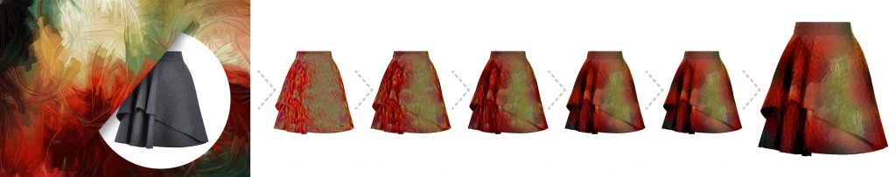

# 神经风格迁移实践

## 1. 神经风格迁移

### 1）简介

**神经风格迁移**是卷积神经网络最具创造性的应用之一，它将一张图片的内容和另一幅图片的风格相结合，生成一张新的艺术化图片。

神经风格迁移能够实现的原因，源于卷积神经网络能很好的表示图像的特征。其采用预训练的卷积神经网络（如VGG16，VGG19，通常训练以进行图像分类或目标检测）。为了使网络能够实现图像分类，它必须理解图像。

在网络的前几层，它可以学习到一些简单的边缘或纹理特征。而在最后几层，网络就已经可以识别更高级的特征，比如图像中的具体实体。因此，从图像输入到分类标签输出之间的过程，可以看作是一系列复杂的特征提取器。而随着隐藏层的深入，图像的内容和风格特征也可以由其检测出来。


了解了背景知识后，那么将一种图像风格转移到另一幅图象上可以看做是一个优化问题。如何去实现关键点在于两个损失函数的优化。

一是内容损失，用于确保生成的图像和内容图像在内容方面更相似而不是风格。为了正确捕获图像的内容，可以使用生成图像和内容图像在网络中输出层前L层的输出的均方差来表示。

二是风格损失，用于确保生成的图像仅从风格图像上继承类似的样式而不是整个图像。风格损失则需要Gram矩阵来表示。每一个通道都可以是某一特征的检测，而不同通道间的相关程度即不同特征的组合可看作风格的度量。Gram矩阵就是对这些通道的输出的外积取平均。


### 2）应用

* 社交：

  ostagram：https://www.ostagram.me/static_pages/lenta?locale=en

* 创作工具：动画、电影、游戏中某些场景的创作

  Come Swim：https://www.youtube.com/watch?v=u37GTEjnQv4

* 服装设计

  

  


### 3）实现

```python
from tensorflow.keras.applications import VGG19
import tensorflow as tf

import matplotlib.pyplot as plt
import matplotlib as mpl
%matplotlib inline


import numpy as np
import PIL.Image
import functools
import time


# 如果模型下载失败，请按照报错信息链接手动下载模型，并保存到C:\Users\用户名\.keras\models
vgg = VGG19(input_shape=(224,224,3),weights="imagenet",include_top=False)

vgg.summary()

def load_img(img_path):
    max_dim = 512
    img = tf.io.read_file(img_path)
    img = tf.image.decode_image(img, channels=3)
    img = tf.image.convert_image_dtype(img, tf.float32)

    shape = tf.cast(tf.shape(img)[:-1], tf.float32)
    long_dim = max(shape)
    scale = max_dim / long_dim

    new_shape = tf.cast(shape * scale, tf.int32)

    img = tf.image.resize(img, new_shape)
    img = img[tf.newaxis, :]
    return img

def imshow(image, title=None):
    if len(image.shape) > 3:
        image = tf.squeeze(image, axis=0)

    plt.imshow(image)
    if title:
        plt.title(title)
        
style_img_path = r"./3628e6bfcc271a0fcf84f268d1b68ea15ee74823.png"
test_content_img = r".\test.jpg"

content_img = load_img(test_content_img)
style_img = load_img(style_img_path)
plt.subplots(figsize=(20,7))
plt.subplot(1,2,1)
imshow(content_img, "Content Image")
plt.subplot(1,2,2)
imshow(style_img, "Style Image")

content_layers = ["block5_conv2"] # 内容层
style_layers = ["block1_conv1", "block2_conv1", "block3_conv1", "block4_conv1", "block5_conv1",]

num_content_layers = len(content_layers)
num_style_layers = len(style_layers)

def vgg_layers(layer_names):
    vgg = tf.keras.applications.VGG19(include_top=False, weights="imagenet")
    vgg.trainable = False
    
    outputs = [vgg.get_layer(name).output for name in layer_names]
    
    model = tf.keras.Model([vgg.input],outputs)
    return model

def gram_matrix(input_tensor):
    result = tf.einsum('bijc,bijd->bcd', input_tensor, input_tensor) # output[b,c,d] = input[b,i,j,c] * input[b,i,j,d]
    input_shape = tf.shape(input_tensor)
    num_locations = tf.cast(input_shape[1]*input_shape[2], tf.float32)
    return result / num_locations

class StyleContentModel(tf.keras.models.Model):
    def __init__(self, style_layers, content_layers):
        super(StyleContentModel, self).__init__()
        self.vgg = vgg_layers(style_layers + content_layers)
        self.style_layers = style_layers
        self.content_layers = content_layers
        self.num_style_layers = len(style_layers)
    
    @tf.function
    def call(self, inputs):
        inputs = inputs * 255.0
        preprocessed_input = tf.keras.applications.vgg19.preprocess_input(inputs)
        outputs = self.vgg(preprocessed_input)
        style_outputs, content_outputs = (outputs[:self.num_style_layers], outputs[self.num_style_layers:])
        style_outputs = [gram_matrix(style_output) for style_output in style_outputs]
        
        content_dict = {content_name:value for content_name, value in zip(self.content_layers,content_outputs)}
        style_dict = {style_name:value for style_name, value in zip(self.style_layers,style_outputs)}
        
        return {"content": content_dict, "style": style_dict}
    
extractor = StyleContentModel(style_layers, content_layers)

style_targets = extractor(style_img)["style"]
content_targets = extractor(content_img)["content"]

image = tf.Variable(content_img)
def clip_0_1(image):
    return tf.clip_by_value(image, clip_value_min=0.0, clip_value_max=1.0)

opt = tf.keras.optimizers.Adam(learning_rate=0.02, beta_1=0.99)

style_weight = 1e-2
content_weight = 1e4
total_variation_weight = 30

def style_content_loss(outputs):
    style_outputs = outputs['style']
    content_outputs = outputs["content"]
    style_loss = tf.add_n([tf.reduce_mean((style_outputs[name] - style_targets[name]) ** 2) for name in style_outputs.keys()])
    style_loss *= style_weight / num_style_layers
    
    content_loss = tf.add_n([tf.reduce_mean((content_outputs[name] - content_targets[name]) ** 2) for name in content_outputs.keys()])
    content_loss *= content_weight / num_content_layers
    
    loss = style_loss + content_loss
    
    return loss

@tf.function
def train_step(image):
    with tf.GradientTape() as tape:
        outputs = extractor(image)
        loss = style_content_loss(outputs)
        loss += total_variation_weight*tf.image.total_variation(image)
        
    grad = tape.gradient(loss, image)
    opt.apply_gradients([(grad, image)])
    image.assign(clip_0_1(image))
    
epochs = 10
steps_per_epoch = 20

start = time.time()
step = 0

for n in range(epochs):
    for m in range(steps_per_epoch):
        step += 1
        train_step(image)
        print(".", end="")
    imshow(image.read_value()[0])
    plt.title("Train step: {}".format(step))
    plt.show()
    
end = time.time()
print("Total time: {:.1f}".format(end-start))
```


## 2. 实时神经风格迁移


